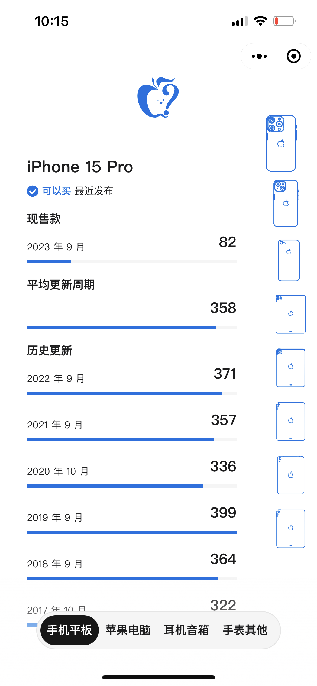

# Buyer's Guide Theif Worker

## 使用 cloudflare workers 从 macrumors 抓取 buyer's guide

#### 关于数据存储

Cloudflare 的 D1、KV、Durable Object 都可以用来存储数据。  
这个例子中使用的是 D1。  
因为 KV 的免费读写次数比较少。DurableObject 最适合但需要开通付费计划。  
故使用 D1 进行数据存储，如果你有条件应该替换项目中的 D1 为 DurableObject 以提高性能。

#### 数据抓取

使用 cheerio 进行数据抓取。  
网页结构可能变化，你将需要自行修改那部分的代码以获取正确的数据。

## Taro client

修改`packages/server/wrangler.toml.example` 为 `packages/server/wrangler.toml`，并替换你的 cloudflare 账号信息。  
修改 `packages/client/.env.production` 中的地址为你的 worker 地址。

> apple product svg: [https://www.dimensions.com/](https://www.dimensions.com/)
